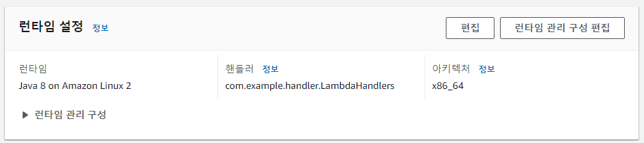
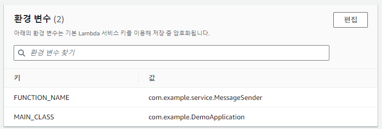
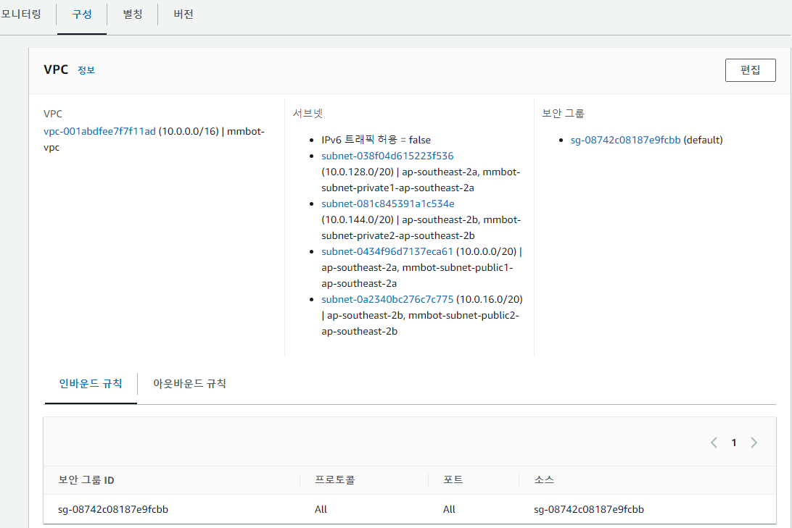

# Spring과 Webhooks를 이용한 Mattermost 메시지 자동화 봇

## 프로젝트 개요

이 프로젝트는 Spring과 Webhooks를 활용하여 Mattermost에 메시지를 자동으로 보내는 봇을 구현합니다.

---
## 주요 기능

- **12:00 명찰 패용 알리미**: 매일 점심시간마다 자동으로 명찰 패용 알림 메시지를 Mattermost로 전송하는 알림봇입니다.

---
## 테스트 및 실행

### 로컬 서버 테스트


### docker 컨테이너를 이용한 테스트용 mattermost 채널 제작


### docker 컨테이너 상에서의 람다 함수(메시지봇) 테스트


---
## 빌드 및 배포

람다 함수에 업로드할 ZIP 파일을 생성하려면 다음 명령어 사용:

```bash
gradlew buildZip
```

### VPC 설정


### 람다 설정







### Amazon EventBridge 설정


---
## Trouble Shooting

### gradlew buildZip 예외

- **문제 설명**: `cmd`에서 `gradlew buildZip` 명령어를 실행할 때 다음과 같은 예외가 발생

    ```plaintext
    FAILURE: Build failed with an exception.
    
    * What went wrong:
    Execution failed for task ':compileJava'.
    > invalid source release: 11
    
    * Try:
    > Run with --stacktrace option to get the stack trace.
    > Run with --info or --debug option to get more log output.
    > Run with --scan to get full insights.
    > Get more help at https://help.gradle.org.
    
    Deprecated Gradle features were used in this build, making it incompatible with Gradle 9.0.
    ```

- **해결 방법**:
    - 해당 컴퓨터의 환경변수 (`JAVA_HOME`, `Path`)가 JDK 버전에 맞게 세팅되어 있는지 확인
    - JDK 11이 설치되어 있는지 확인하고, 환경변수 `JAVA_HOME`이 JDK 11의 경로를 가리키도록 설정
    - Gradle 버전이 JDK 11과 호환되는 버전을 사용하는지 확인

### AWS Lambda ConnectException

- **문제 설명**: 로컬에서는 정상 작동되나 AWS Lambda에 배포하면 다음과 같은 예외가 발생

    ```plaintext
    "errorMessage": "I/O error on POST request for \"https://meeting.ssafy.com/hooks/(URL)\": Connection timed out (Connection timed out); nested exception is java.net.ConnectException: Connection timed out (Connection timed out)",
    "errorType": "org.springframework.web.client.ResourceAccessException", ...
    ```

- **해결 방법**:
    - [aws 공식문서](https://repost.aws/ko/knowledge-center/lambda-function-retry-timeout-sdk)을 참조
    - 스프링 코드에 timeout config 파일 추가

### AWS Lambda ConnectException

- **문제 설명**: 패키지 구조 변경 이후 AWS Lambda에 배포하면 다음과 같은 예외가 발생

    ```plaintext
    "errorMessage": "I/O error on POST request for \"https://meeting.ssafy.com/hooks/(URL)\": Connection timed out (Connection timed out); nested exception is java.net.ConnectException: Connection timed out (Connection timed out)",
    "errorType": "org.springframework.web.client.ResourceAccessException", ...
    ```

- **해결 방법**:
  - 연결 타임아웃을 30초 -> 50초로 증가
  
  - 패키지 구조가 복잡해지며 람다 상에서 연결 타임아웃 30초를 초과한 것으로 추정됨

---
## 참고 자료

- [Spring과 AWS Lambda 배포 및 실행 방법](https://may9noy.tistory.com/1333)
- [Spring과 AWS Lambda 배포 및 실행 방법 2](https://may9noy.tistory.com/1334)
- [AWS Lambda를 특정 시간에 실행하기](https://easyaws.tistory.com/16)
- [Webhook 설정 가이드](https://olrlobt.tistory.com/64)